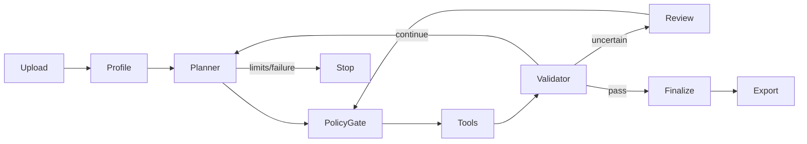

# PrepPilot

**From messy data to trusted data.** PrepPilot is a local CSV/XLSX preparation and quality application built around deterministic tools, an evidence-based planner, a bounded LangGraph workflow, explicit review, validation, and a replayable operation ledger.

## What it does

- Ingests CSV and XLSX files, allows Excel sheet selection, enforces configurable limits, and stores original bytes with a SHA-256 hash.
- Profiles columns, missing values, whitespace, identifiers, duplicates, sentinel candidates, numeric distributions, and likely types without an LLM.
- Accepts versioned YAML with schema constraints, quality rules, policy, execution budgets, and an allowlisted set of operations.
- Uses LangGraph for planning, deterministic execution, validation routing, and bounded safe stops.
- Preserves source-row IDs, operation hashes, review decisions, and sparse changed-cell provenance; can replay approved ledger entries from the source.
- Automatically trims observed leading/trailing whitespace. Missing-value imputation, placeholder replacement, row/column deletion, and other consequential changes require explicit policy and review; final user approval is also required before trusted export.
- Exports sanitized CSV/XLSX and an audit ZIP with reports and ledger.
- Includes a seeded synthetic evaluation harness comparing no-op, fixed pandas, and scripted-agent behavior.

The application is agentic because its planner selects actions from the measured dataset profile; LangGraph routes those actions through policy, deterministic tools, and validation; and the resulting evidence affects whether the workflow continues, requests review, or safely stops. A planner proposal is not authorization. Authorization is decided by policy and the user's review; tools execute the approved operation; validation independently judges the candidate.

## Architecture

See [docs/ARCHITECTURE.md](docs/ARCHITECTURE.md), [docs/DATA_CONTRACTS.md](docs/DATA_CONTRACTS.md), [docs/AGENT_DESIGN.md](docs/AGENT_DESIGN.md), and [docs/SECURITY.md](docs/SECURITY.md).



## Local setup

Python 3.11 or newer is recommended. In PowerShell:

```powershell
py -3.11 -m venv .venv
.\.venv\Scripts\Activate.ps1
python -m pip install -r requirements-dev.txt
Copy-Item .env.example .env
python scripts/init_project.py
python run.py
```

Open the local Flask URL printed by the server. To run checks:

```powershell
pytest
ruff check app tests scripts
```

Run and inspect a real benchmark:

```powershell
python -m app.evaluation.runner --mode deterministic
python -m app.evaluation.runner --mode scripted-agent
python -m app.evaluation.runner --mode llm
```

LLM mode reports a skipped run unless `PREPPILOT_PLANNER` is set to `openai` or `groq`, the matching provider key is configured, and you explicitly enable `PREPPILOT_ALLOW_DATA_TO_LLM=1`. The Responses API adapter sends a compact profile without cell examples; it never uploads the source file. Groq supports a limited free plan; check its current limits before deploying. The offline planner and tests require no network or API key.

Replay a completed job:

```powershell
python scripts/replay_job.py --job-id JOB_ID
```

## GitHub and Vercel deployment

The repository includes a Vercel Flask entry point (`index.py`), Python 3.12 pin, static assets under `public/`, and a `vercel.json` configuration. Local development continues to use SQLite; Vercel deployments use PostgreSQL. Uploaded source files, candidate snapshots, and exports are stored in PostgreSQL `BYTEA` columns, which is intended for the configured small-file portfolio demo.

To push the project to GitHub, create an empty repository, then run these commands from the project folder (replace the URL with your repository URL):

```powershell
git init -b main
git add .
git status
git commit -m "Build PrepPilot data preparation platform"
git remote add origin https://github.com/YOUR_USERNAME/PrepPilot.git
git push -u origin main
```

Check `git status` before committing. `.gitignore` excludes `.env`, virtual environments, local databases, and Vercel project metadata. Do not commit secrets or real customer data.

In Vercel, import the GitHub repository and connect a PostgreSQL integration that provides a pooled connection URL. Configure these project environment variables before deploying:

- `DATABASE_URL`: pooled PostgreSQL connection string.
- `SECRET_KEY`: a long random secret used to sign sessions.
- Optional hosted planning: set `PREPPILOT_PLANNER=groq`, `GROQ_API_KEY`, and `PREPPILOT_ALLOW_DATA_TO_LLM=1` for Groq, or set `PREPPILOT_PLANNER=openai`, `OPENAI_API_KEY`, and the same consent flag for OpenAI. Groq defaults to model `openai/gpt-oss-20b` and endpoint `https://api.groq.com/openai/v1`.

Vercel's function request and response body limit is 4.5 MB; PrepPilot defaults to a conservative 2 MB upload limit on Vercel and 25 MB locally to leave room for multipart overhead and exports. No login is required, and all visitors share the same workspace. Do not use sensitive data or treat this demo as a production multi-tenant service.

Each push to the connected production branch triggers a new Vercel deployment. Configure environment variables separately for Preview and Production if you use both.

## Supported operations

The registry supports trim/whitespace normalization, case normalization, explicit numeric/date parsing, safe column rename/normalization, duplicate/empty/missing row and column removal under policy, and missing-value imputation by explicit value, mean, median, or mode. The web review flow asks for separate approval before imputation or row removal. The default evidence planner automatically trims observed outer whitespace and proposes high-risk duplicate removal for review. It preserves numeric-looking IDs, uncertain dates, sentinels, outliers, and missing values unless a user selects an explicit treatment and approves it.

## Review, lineage, and replay

Original source bytes are immutable. Every successful operation records ordered input/output hashes and versions. Sparse operation evidence records changed cell row/column IDs and value hashes; `/jobs/<job_id>/lineage?row_id=…&column=…` reports the output value and responsible operation IDs. Replay verifies the source hash and each operation input/output hash. Row deletion and imputation are disabled by default. Repeated review submissions are rejected after a review is resolved.

## Evaluation

The harness creates 100 reproducible cases across ten controlled scenario families. See [docs/EVALUATION.md](docs/EVALUATION.md) for ground-truth policy and limitations. Reports are generated by the command and stored in `data/benchmarks/` plus the configured database. The checked-in benchmark is historical and is not evidence of broad real-world generalization.

## Known limitations

- The default planner is offline. Hosted Groq or OpenAI planning requires the provider's API key and explicit profile-sharing opt-in.
- LangGraph invocation is synchronous. Review decisions are persisted and applied through services, but durable LangGraph checkpoint/interrupt resume is not wired yet.
- Local development uses SQLite; Vercel uses PostgreSQL. Both store source bytes and candidate snapshots in the database, suitable for small demos rather than large-scale ingestion.
- Validation supports the documented schema and simple rules; complex cross-column business constraints are not implemented.
- Cell provenance records hashes and operation links, not a complete raw before-value history. Generated rows and multi-source joins are not supported.
- No login is required locally or on Vercel; there are no individual accounts or per-user data isolation, so visitors share one workspace.
- XLSX output currently contains the cleaned dataset in one sheet; multi-sheet artifact preservation is not implemented.

## Demo

Follow [docs/DEMO_SCRIPT.md](docs/DEMO_SCRIPT.md). The controlled sample corruption is catalogued in [data/sample/README.md](data/sample/README.md).
