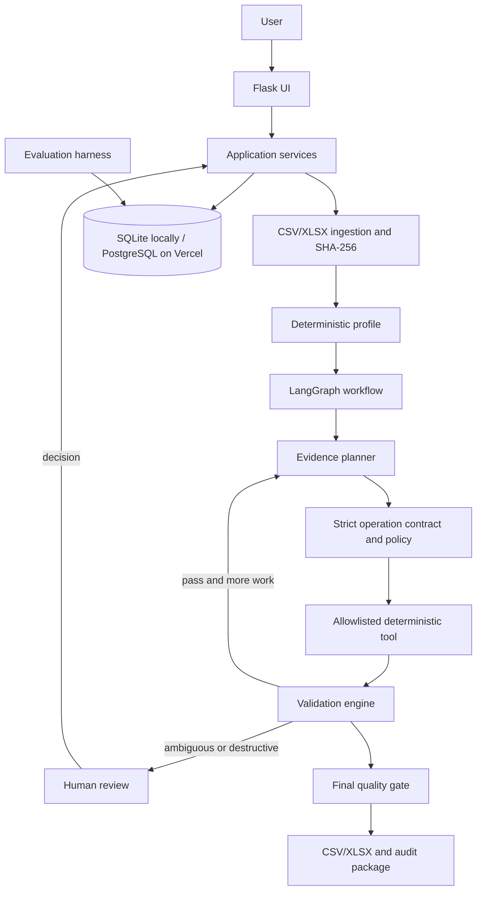

# Architecture

PrepPilot is a modular Flask monolith. Flask routes validate and render requests; application services own lifecycle decisions; SQLite stores local state, while Vercel deployments use PostgreSQL for source bytes, candidate snapshots, operations, review decisions, audit events, and benchmark summaries. pandas/openpyxl handle datasets. A LangGraph `StateGraph` performs planning, deterministic tool execution, post-operation validation, and bounded routing.

## Trust boundaries

- Uploaded bytes are stored as the immutable original and identified by SHA-256.
- Internal row IDs are deterministic for a source hash and row position; they are carried as a private working column and excluded from user exports.
- Planner recommendations are validated against a Pydantic operation schema and an application policy gate.
- Only `app.tools.registry` can change a candidate. It works on a deep copy and returns a new candidate only on success.
- The validator is deterministic and independent of planner output.
- A final artifact is created only after the user finalizes a ready candidate and configured quality rules pass.

## Current implementation notes

The default planner is an offline evidence planner. It proposes whitespace trimming when observed and routes duplicate removal for human review. The `PlannerClient` interface includes a scripted client and an optional OpenAI Responses adapter. Hosted planning requires an API key and explicit `PREPPILOT_ALLOW_DATA_TO_LLM=1`; it sends a compact profile without cell examples and never sends file contents. The review screen records approval/rejection and starts a new bounded LangGraph pass from persisted candidate, specification, ledger, and review decision. This is service-level resume; the graph itself does not use a durable checkpoint saver. Local development uses SQLite; Vercel requires a durable PostgreSQL URL and applies a shared access-password gate.
